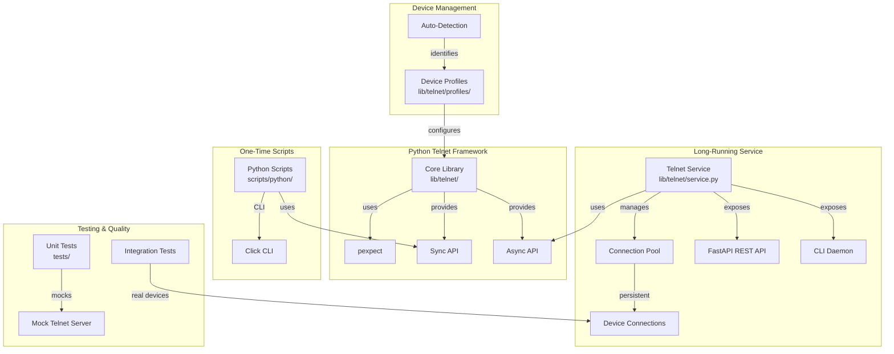

# Comprehensive Telnet Automation Framework

## Overview

Create a complete Python-based telnet automation framework to replace and enhance the existing expect-based scripts. The framework will support both one-time scripts and long-running services with connection pooling, REST API access, and comprehensive device management.

## Architecture



## Implementation Plan

### Phase 1: Core Framework Foundation

#### 1.1 Project Structure Setup
- Create `lib/telnet/` directory structure
- Set up `pyproject.toml` with dependencies (pexpect, fastapi, click, pydantic, etc.)
- Create virtual environment configuration
- Add Makefile targets for Python development

#### 1.2 Core Telnet Client Library
**File: `lib/telnet/client.py`**
- Base `TelnetClient` class with pexpect integration
- Connection management (connect, disconnect, reconnect)
- Authentication handling (login prompts, password prompts)
- Command execution with timeout handling
- Output parsing and prompt detection
- Error handling with custom exceptions

**File: `lib/telnet/exceptions.py`**
- Custom exception hierarchy:
- `TelnetError` (base)
- `ConnectionError`, `AuthenticationError`, `TimeoutError`, `CommandError`

#### 1.3 Device Profiles System
**File: `lib/telnet/profiles/__init__.py`**
- Base `DeviceProfile` class
- Profile registry and factory pattern

**File: `lib/telnet/profiles/busybox.py`**
- BusyBox device profile (handles BusyBox-specific prompts)

**File: `lib/telnet/profiles/linux.py`**
- Standard Linux shell profile (bash, sh)

**File: `lib/telnet/profiles/custom.py`**
- Custom/unknown device profile with auto-detection

**File: `lib/telnet/profiles/auto_detect.py`**
- Auto-detection logic to identify device type from connection

### Phase 2: Sync and Async APIs

#### 2.1 Synchronous API
**File: `lib/telnet/sync_client.py`**
- Synchronous wrapper around core client
- Thread-safe for use in scripts
- Simple blocking interface

#### 2.2 Asynchronous API
**File: `lib/telnet/async_client.py`**
- Async wrapper using asyncio
- Non-blocking operations
- Supports concurrent device operations

#### 2.3 Connection Pool Manager
**File: `lib/telnet/pool.py`**
- `ConnectionPool` class for managing multiple device connections
- Persistent connection management
- Automatic reconnection on failure
- Health checks and connection validation
- Connection lifecycle management

### Phase 3: Logging and Configuration

#### 3.1 Structured Logging
**File: `lib/telnet/logging.py`**
- Structured logging with JSON output option
- Text output compatible with existing format
- Log levels and formatting
- Contextual logging (device IP, command, etc.)

#### 3.2 Configuration Management
**File: `lib/telnet/config.py`**
- Configuration loading from YAML/JSON
- Environment variable support
- Default values and validation
- Integration with existing `iot-config.yaml`

### Phase 4: One-Time Scripts Framework

#### 4.1 CLI Framework
**File: `lib/telnet/cli.py`**
- Click-based CLI framework
- Common options (--target, --username, --password, --timeout)
- Output formatting (--json, --verbose, --quiet)
- Command grouping and help system

#### 4.2 Script Migration Examples
**File: `scripts/python/execute_command.py`**
- Python equivalent of `execute_command()` function
- Drop-in replacement with improved error handling

**File: `scripts/python/analyze_connections.py`**
- Migrated version of `analyze-connections.sh`
- Demonstrates Python framework usage

**File: `scripts/python/block_cloud_process.py`**
- Migrated version of `block-cloud-process.sh`
- Shows command execution patterns

### Phase 5: Long-Running Service

#### 5.1 Service Core
**File: `lib/telnet/service.py`**
- Main service class managing connection pool
- Background task management
- Health monitoring
- Graceful shutdown handling

#### 5.2 REST API
**File: `lib/telnet/api/__init__.py`**
- FastAPI application setup

**File: `lib/telnet/api/routes/devices.py`**
- Device management endpoints:
- `POST /devices/{ip}/connect` - Connect to device
- `POST /devices/{ip}/execute` - Execute command
- `GET /devices/{ip}/status` - Get connection status
- `DELETE /devices/{ip}/disconnect` - Disconnect
- `GET /devices` - List all managed devices

**File: `lib/telnet/api/routes/health.py`**
- Health check endpoints
- Service status and metrics

**File: `lib/telnet/api/models.py`**
- Pydantic models for API requests/responses

#### 5.3 CLI Daemon
**File: `lib/telnet/daemon.py`**
- CLI daemon using Click
- Background process management
- Service control (start, stop, status, restart)
- Log file management

### Phase 6: Testing Infrastructure

#### 6.1 Mock Telnet Server
**File: `tests/mock_telnet_server.py`**
- Mock telnet server for unit tests
- Simulates various device types
- Configurable prompts and responses

#### 6.2 Unit Tests
**File: `tests/test_client.py`**
- Core client functionality tests
- Authentication tests
- Command execution tests
- Error handling tests

**File: `tests/test_pool.py`**
- Connection pool tests
- Reconnection logic tests
- Health check tests

**File: `tests/test_profiles.py`**
- Device profile tests
- Auto-detection tests

#### 6.3 Integration Tests
**File: `tests/integration/test_real_devices.py`**
- Optional integration tests with real devices
- Marked with pytest markers for conditional execution

### Phase 7: Documentation and Migration Guide

#### 7.1 Documentation
**File: `lib/telnet/README.md`**
- Framework overview
- API documentation
- Usage examples
- Migration guide from expect scripts

#### 7.2 Migration Compatibility
- Keep existing expect scripts during transition
- Create Python equivalents with same functionality
- Document migration path
- Provide compatibility layer if needed

### Phase 8: Integration with Existing Project

#### 8.1 Makefile Integration
- Add targets for Python framework:
- `make telnet-service` - Start telnet service
- `make telnet-api` - Start REST API
- `make test-telnet` - Run telnet framework tests

#### 8.2 Configuration Integration
- Extend `iot-config.yaml` with telnet service configuration
- Support existing device credentials and settings

## Key Features

1. **Dual API Support**: Both sync (for scripts) and async (for services) APIs
2. **Connection Pooling**: Hybrid approach with persistent connections, auto-reconnect, and health checks
3. **Device Profiles**: Extensible profile system with auto-detection
4. **Structured Logging**: JSON logging with text output compatibility
5. **REST API**: FastAPI-based API for programmatic access
6. **CLI Daemon**: Background service with CLI control
7. **Comprehensive Testing**: Unit tests with mocks + optional integration tests
8. **Migration Path**: Parallel support during transition from expect to Python

## Dependencies

- `pexpect` - Telnet interaction
- `fastapi` + `uvicorn` - REST API
- `click` - CLI framework
- `pydantic` - Data validation
- `pyyaml` - Configuration parsing
- `pytest` + `pytest-asyncio` - Testing
- `pytest-mock` - Mocking support

## File Structure

```
lib/telnet/
├── __init__.py
├── client.py              # Core telnet client
├── sync_client.py         # Synchronous API
├── async_client.py        # Asynchronous API
├── pool.py                # Connection pool
├── service.py             # Long-running service
├── daemon.py              # CLI daemon
├── cli.py                 # CLI framework
├── config.py              # Configuration
├── logging.py             # Structured logging
├── exceptions.py          # Custom exceptions
├── profiles/
│   ├── __init__.py
│   ├── base.py
│   ├── busybox.py
│   ├── linux.py
│   ├── custom.py
│   └── auto_detect.py
└── api/
    ├── __init__.py
    ├── models.py
    └── routes/
        ├── devices.py
        └── health.py

scripts/python/
├── execute_command.py     # Core command execution
├── analyze_connections.py # Migrated script
├── block_cloud_process.py  # Migrated script
└── ...                    # Other migrated scripts

tests/
├── mock_telnet_server.py
├── test_client.py
├── test_pool.py
├── test_profiles.py
└── integration/
    └── test_real_devices.py
```

## Success Criteria

1. All core functionality from expect scripts replicated in Python
2. Both sync and async APIs working
3. Connection pool with auto-reconnect functioning
4. REST API serving device management endpoints
5. CLI daemon running as background service
6. Unit tests with >80% coverage
7. Documentation complete
8. Existing expect scripts remain functional during transition

